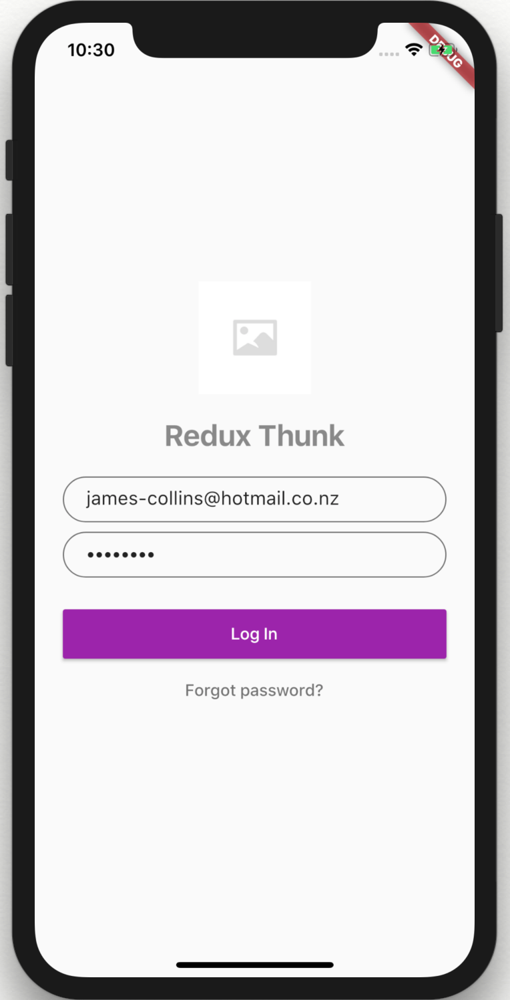
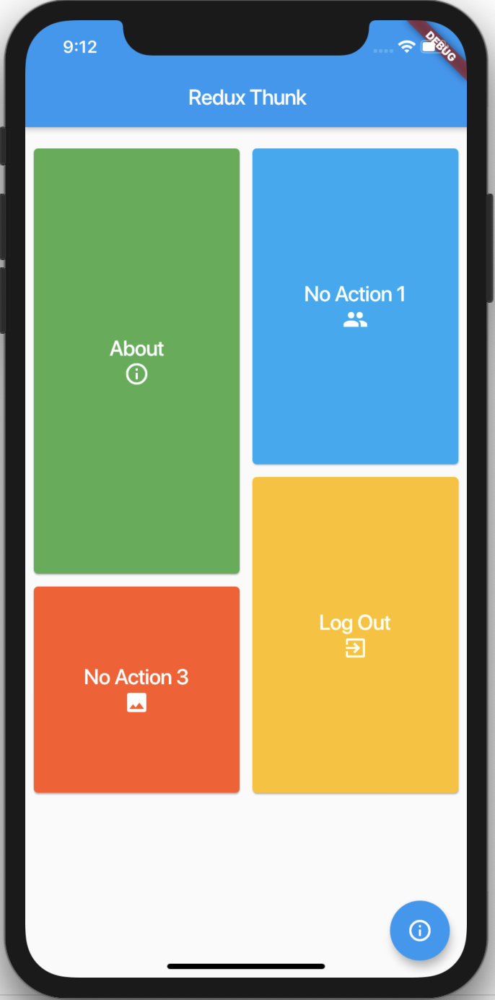

# Flutter redux thunk boilerplate

## Description
A boilterplate flutter app using redux with redux thunk middleware & json_serializable for json serialization.

## Development
- [Running](docs/running.md)
- [Upgrading](docs/upgrading.md)

## Architecture
- [Widget architecture](docs/widget-architecture.md)
 
 ## Images

